# ODVGateway

ODVGateway is a small ASP.NET Core service that turns the existing
WebClient `MediaViewerTwo.cshtml` handoff into an OpenDocViewer session. It
keeps the original iframe URL the host application already renders, but
serves the selected files itself from server-side paths, the WebClient
ticket stream, or both. ODVGateway is also packaged as an OpenModulePlatform
(OMP) web-app artifact (`odvgateway-web`).

Current application version (`Directory.Build.props` `<Version>`):
**v0.1.42**. Current OMP artifact version (`omp-components.json`):
**0.1.50**. The two lines are deliberately independent — the OMP artifact
can move for a deployable change without an official release, and an
official release can ship without bumping the artifact. Read both numbers
out of their files; this paragraph names them once and can lag. Verified
2026-09-26 against `Directory.Build.props`, `omp-components.json`, and
`odvgateway.module-definition.json`.

The companion SPA it serves is the public
[OpenDocViewer](https://github.com/niclas-berg/OpenDocViewer) project.
ODVGateway contains no viewer code of its own; it only hands off to and
streams bytes for that viewer.

## What it is

- A minimal-API ASP.NET Core 10 application that adapts a host WebClient
  `prep` payload into an OpenDocViewer bootstrap (`/bundle/{key}`) and
  serves the document bytes (`/source/{key}/{idx}` or
  `/source-pack/{key}`).
- A reusable WebClient ticket-stream proxy: when the host WebClient sends
  a `filePath` the gateway cannot read directly, ODVGateway can either
  pass the original ticket URL to the viewer or proxy the bytes itself,
  byte-capped and chunked.
- An OMP-compatible web-app component (`moduleKey: odvgateway`,
  `appKey: odvgateway_webapp`, `packageType: web-app`,
  `targetName: odvgateway`) built through the shared `scripts/omp/*`
  tooling.

## What it is not

- Not an OpenDocViewer fork and not a viewer. The viewer HTML, JS, CSS and
  viewer-side print/PDF pipeline live in the OpenDocViewer project and are
  consumed as a built `dist/` folder.
- Not an OpenModulePlatform host. ODVGateway intentionally does not
  require OMP authentication, because the WebClient handoff is the trust
  boundary in front of it. It can run as a standalone IIS or Kestrel
  application outside OMP.
- Not a shared session store. The prepared session table is in process
  memory (see [Session store](#session-store)), so multi-instance
  deployments need sticky routing or a shared store added before traffic
  can move between instances.
- Not a generic file server. Direct server-side reads only fire when
  `trustClientFilePath=true` AND every requested path resolves below a
  configured `trustedSourceRoots` entry (see
  [Direct source access](#direct-source-access)).

## Architecture

The gateway sits between the host WebClient and the OpenDocViewer SPA. The
viewer is served out of a sibling `dist/` folder; the gateway only owns
the `/prep`, `/`, `/bundle/{key}`, `/source/{key}/{idx}` and
`/source-pack/{key}` endpoints and the trust boundary around them.

```mermaid
flowchart LR
    User([Browser]) -->|HTTPS| WC[WebClient<br/>MediaViewerTwo.cshtml]
    WC -->|POST /prep<br/>sessiondata JSON| GW[ODVGateway<br/>ASP.NET Core 10]

    subgraph Boundary[ODVGateway trust boundary]
        direction TB
        Prep[/prep<br/>WebClientHandoffGuard<br/>GatewaySessionStore/]
        Viewer[/<br/>OpenDocViewerIndexRenderer/]
        Bundle[/bundle/&#123;key&#125;<br/>OpenDocViewerBundleFactory/]
        Source[/source/&#123;key&#125;/&#123;i&#125;<br/>DirectSourceFileResolver/]
        Pack[/source-pack/&#123;key&#125;<br/>odvsp1 stream/]
    end

    GW --- Prep
    GW --- Viewer
    GW --- Bundle
    GW --- Source
    GW --- Pack

    Prep -. in-memory .-> Bundle
    Bundle -->|window.ODV bootstrap| Viewer
    Viewer -->|/bundle/&#123;key&#125;| Bundle
    Viewer -->|/source-pack/&#123;key&#125;| Pack

    Source -->|file read| FS[(Trusted source root<br/>local or UNC)]
    Pack -->|file read| FS
    Pack -->|HttpClient| WCF[WebClient<br/>GetStream ticket]
    Source -->|HttpClient| WCF

    ODV[OpenDocViewer dist/<br/>index.html + bundles] -->|StaticFileProvider| Viewer

    style GW fill:#eef,stroke:#446
    style Boundary fill:#fafafa,stroke:#999,stroke-dasharray: 4 3
```



Sources for this diagram:

- `src/ODVGateway/Program.cs` — endpoint mapping (`/`, `/prep`,
  `/bundle/{sessionKey}`, `/source/{sessionKey}/{fileIndex:int}`,
  `/source-pack/{sessionKey}`, `/health`).
- `src/ODVGateway/Services/WebClientHandoffGuard.cs` — initiator
  allowlist check.
- `src/ODVGateway/Services/GatewaySessionStore.cs` — in-memory session
  table.
- `src/ODVGateway/Services/OpenDocViewerBundleFactory.cs` — bundle
  shape.
- `src/ODVGateway/Services/DirectSourceFileResolver.cs` — trusted-root
  enforcement.
- `src/ODVGateway/Services/OpenDocViewerDistResolver.cs` — dist folder
  resolution.

## Request lifecycle for one document

The handoff is split into three calls. The first two are initiated by
WebClient; the viewer issues the rest.

```mermaid
flowchart TD
    A([User clicks a document<br/>in WebClient]) --> B[WebClient renders<br/>MediaViewerTwo iframe<br/>pointed at ODVGateway]
    B --> C[Browser POST /prep<br/>with WebClient payload]
    C --> D{WebClientHandoffGuard<br/>allowedInitiatorUrls empty?}
    D -- yes --> F[GatewaySessionStore.Store<br/>allocates sessionKey<br/>+ handoffLookupKey<br/>(fail-open, dev only)]
    D -- no --> E{Referer/Origin matches<br/>an allowedInitiatorUrls entry?}
    E -- no --> EH[/403 Forbidden<br/>Referer/Origin not in allowlist/]
    E -- yes --> F
    F --> G[Build GatewaySourceFile list<br/>FileTicket.Parse]
    G --> H[200 OK: sessionKey,<br/>document + file count, expiresUtc]
    H --> I[WebClient opens iframe<br/>GET /?sessiondata=&lt;token&gt;]

    I --> J{useBundleUrlHandoff?}
    J -- no --> K[Decode sessiondata<br/>+ match by handoffLookupKey<br/>+ render index.html inline<br/>with window.ODV payload]
    J -- yes --> L[Decode sessiondata<br/>+ match by handoffLookupKey]
    L --> M[302 redirect<br/>Referrer-Policy: strict-origin-when-cross-origin]
    M --> N[Browser GET /?bundleUrl=&lt;url&gt;]
    N --> K

    K --> O[OpenDocViewer dist runs<br/>window.ODV.start]
    O --> P[Viewer fetches<br/>GET /bundle/&#123;key&#125;]
    P --> Q[OpenDocViewerBundleFactory.CreateAsync]
    Q --> R[Viewer fetches sources<br/>GET /source-pack/&#123;key&#125;<br/>or /source/&#123;key&#125;/&#123;i&#125;]
    R --> S{DirectSourceFileResolver<br/>under trustedSourceRoots?}
    S -- yes --> T[Stream file with range support<br/>Results.File + enableRangeProcessing]
    S -- no --> U{ShouldProxyWebClientFallback?}
    U -- yes --> V[HttpClient GET WebClient<br/>byte-capped + chunked]
    U -- no --> W[Pass WebClient ticket URL<br/>to viewer]
```

Sources for this diagram:

- `Program.cs` `MapPost("/prep", ...)` — `/prep` handler and
  `GatewaySessionStore.Store`.
- `Program.cs` `RenderViewerAsync` — `?sessiondata=` redirect path and
  `useBundleUrlHandoff` switch.
- `Program.cs` `MapGet("/bundle/{sessionKey}", ...)` — bundle fetch.
- `Program.cs` `MapGet("/source/{sessionKey}/{fileIndex:int}", ...)` —
  single-file route with range support and WebClient proxy fallback.
- `Program.cs` `MapGet("/source-pack/{sessionKey}", ...)` —
  `application/vnd.opendocviewer.source-pack` stream format (`odvsp1`).
- `Services/DirectSourceFileResolver.cs` — trusted-root check.
- `Services/WebClientFallbackUrlBuilder.cs` — fallback URL construction.

## API surface and error paths

```mermaid
sequenceDiagram
    autonumber
    participant Browser
    participant WC as WebClient<br/>(host)
    participant GW as ODVGateway
    participant Store as GatewaySessionStore
    participant Files as DirectSourceFileResolver
    participant FS as Source files / WebClient

    Browser->>WC: click document
    WC->>Browser: render MediaViewerTwo iframe<br/>URL = /ODVGateway/
    Browser->>GW: POST /prep
    GW->>GW: WebClientHandoffGuard.Validate<br/>(Referer / Origin vs allowedInitiatorUrls)
    alt initiator rejected
        GW-->>Browser: 403 Forbidden
    else store full
        GW->>Store: Store(prep)
        Store-->>GW: CapacityExceeded
        GW-->>Browser: 429 Too Many Requests<br/>(maxConcurrentSessions)
    else accepted
        Store-->>GW: session, sessionKey, expiresUtc
        GW-->>Browser: 200 OK { sessionKey, ... }
    end

    Browser->>GW: GET /?sessiondata=<base64-json>
    GW->>GW: Validate handoff headers again
    alt sessiondata malformed
        GW-->>Browser: 400 Bad Request
    else no matching prepared session
        GW-->>Browser: 404 with status page
    else useBundleUrlHandoff true
        GW-->>Browser: 302 ?bundleUrl=&lt;absolute&gt;<br/>Referrer-Policy: strict-origin-when-cross-origin
        Browser->>GW: GET /?bundleUrl=&lt;absolute&gt;
    end

    GW->>Store: TryGetByHandoffLookupKey
    Store-->>GW: GatewaySession
    GW->>GW: OpenDocViewerIndexRenderer.RenderAsync
    GW-->>Browser: 200 text/html<br/>OpenDocViewer index.html + window.ODV bootstrap

    Browser->>GW: GET /bundle/{sessionKey}
    GW->>Store: TryGet(sessionKey)
    Store-->>GW: GatewaySession
    GW->>GW: OpenDocViewerBundleFactory.CreateAsync
    GW-->>Browser: 200 application/json<br/>X-ODVGateway-* diagnostics headers

    Browser->>GW: GET /source-pack/{sessionKey}
    GW->>Store: TryGet(sessionKey)
    GW-->>Browser: 200 application/vnd.opendocviewer.source-pack<br/>Content-Type: odvsp1<br/>X-ODVGateway-Source-Pack: odvsp1
    loop per source file
        GW->>Files: TryResolve(source)
        alt direct path under trustedSourceRoots
            Files-->>GW: DirectSourceFile
            GW-->>Browser: per-file JSON header + bytes
        else WebClient fallback
            GW->>FS: HttpClient GET with ASPXAUTH + ASP.NET_SessionId cookies
            alt success
                FS-->>GW: 200 bytes
                GW-->>Browser: per-file JSON header + bytes
            else payload &gt; maxSourcePackFrameBytes
                GW-->>Browser: per-file JSON header<br/>error: source too large
            else retryable status / timeout
                GW->>FS: retry up to retryCount
            end
        end
    end

    Browser->>GW: GET /health
    GW->>Store: Count
    GW-->>Browser: 200 OK { status: "ok", ... }<br/>or 503 if dist path missing
```

Sources for this diagram: the full pipeline in
`src/ODVGateway/Program.cs`, plus `Services/GatewaySessionStore.cs`
(capacity and lookup), `Services/WebClientHandoffGuard.cs` (Referer /
Origin allowlist), `Services/OpenDocViewerIndexRenderer.cs`
(`window.ODV` bootstrap injection), `Services/OpenDocViewerBundleFactory.cs`
(bundle diagnostics headers), and `Services/ContentTypeMapper.cs`.

## Quickstart

Prerequisites:

- .NET 10 SDK (see `global.json`)
- PowerShell 5.1 or PowerShell 7 for the local CI scripts
- A built OpenDocViewer `dist/` folder (sibling checkout or absolute
  path); see `OpenDocViewerDistResolver.ResolveDistPath`

Clone alongside OpenDocViewer so the default sibling probe
(`../../../OpenDocViewer/dist`) finds it:

```text
~/GitHub/
├── ODVGateway/
└── OpenDocViewer/dist/    ← must contain index.html
```

Run locally:

```powershell
dotnet run --project .\src\ODVGateway\ODVGateway.csproj
```

Default URLs:

| URL | Purpose |
| --- | --- |
| `GET /health` | Liveness + configuration snapshot. Returns 503 when the OpenDocViewer dist folder is missing. |
| `POST /prep` | Store a WebClient payload in the in-memory session table. |
| `GET /` (and `GET /index.html`) | Viewer bootstrap. |
| `GET /bundle/{sessionKey}` | One-shot JSON bundle (with diagnostics headers). |
| `GET /source/{sessionKey}/{fileIndex:int}` | Single source file (range-supported when served from a trusted root). |
| `GET /source-pack/{sessionKey}` | `application/vnd.opendocviewer.source-pack` (odvsp1) stream of all source files. |

Standalone IIS deployment: see [Standalone IIS Deployment](#standalone-iis-deployment).
OMP deployment: see [OpenModulePlatform Packaging](#openmoduleplatform-packaging).

## Configuration

Gateway configuration lives in `appsettings.json` or environment
variables under the `ODVGateway` section. ASP.NET Core host filtering
uses the top-level `AllowedHosts` setting. The shipped defaults are
generic; override them per deployment.

### Session store

| Setting | Default | Notes |
| --- | --- | --- |
| `sessionTtlMinutes` | 30 | Effective minimum is 5 minutes; lower values are clamped and a startup warning is logged. |
| `maxConcurrentSessions` | 50 000 | Per-process; new `/prep` requests receive 429 when full. |
| `maxPrepBodyBytes` | 50 MiB | Drives `FormOptions.ValueLengthLimit`. |
| `webClientHandoff.allowedInitiatorUrls` | `[]` | Empty list **means "everything allowed"** (the guard fails open so a fresh clone can run locally without a configured allowlist). Production deployments must name the host WebClient pages that may start viewer sessions, otherwise the gateway accepts any initiator. |
| `webClientHandoff.allowMissingInitiatorHeaders` | `false` | Compatibility escape hatch; startup logs a warning when enabled. |

The store is process-local and non-durable. Restarts drop pending
handoffs; multi-node production needs sticky routing or a shared session
store added before traffic can move between instances.

### Direct source access

| Setting | Default | Notes |
| --- | --- | --- |
| `trustClientFilePath` | `false` | Enables direct server-side reads from WebClient `filePath`. Keep disabled unless the gateway is in the same trust boundary as the file paths it receives. |
| `trustedSourceRoots` | `[]` | Required when `trustClientFilePath=true`. Every accepted direct file must resolve below one of these absolute local or UNC roots. Startup rejects missing, empty, or relative entries. `{ContentRoot}` is supported as a literal prefix. |

### Source transport

| Setting | Default | Notes |
| --- | --- | --- |
| `useBundleUrlHandoff` | `true` | Redirect `?sessiondata=` to `?bundleUrl=`. Keep enabled for large batches; the inline HTML stays small and the bundle is fetched as one JSON request. |
| `sourceCacheControl` | `no-store` | Cache header for streamed source files. |
| `webClientSourceFallback.enabled` | `true` | Enables WebClient ticket-stream fallback when direct files are not readable. |
| `webClientSourceFallback.requireSameHost` | `true` | Reject fallback URLs whose host differs from the gateway request. |
| `webClientSourceFallback.proxyThroughGateway` | `true` | Proxy fallback bytes through the gateway instead of handing the ticket URL to the viewer. |
| `webClientSourceFallback.proxyThroughGatewayAboveSourceCount` | `1000` | Below this count the viewer is given the WebClient ticket URL; above it the gateway proxies. |
| `maxSourcePackFrameBytes` | 64 MiB | Per-frame cap for `application/vnd.opendocviewer.source-pack`. |
| `maxSourceProxyBytes` | `maxSourcePackFrameBytes` | Per-response cap for the proxied `/source` path. |
| `sourcePackStreamBufferBytes` | 128 KiB | Stream copy chunk size (clamped to 4 KiB – 1 MiB). |
| `inlineSources.enabled` | `true` | Embed small raster sources directly into the bundle. |
| `remoteInlineSources.*` | see `appsettings.json` | Server-side prefetch for small same-host raster WebClient URLs (sequential, retry-on-transient). |

### Viewer and response hardening

| Setting | Default | Notes |
| --- | --- | --- |
| `openDocViewerDistPath` | `""` | Absolute path to the OpenDocViewer `dist/` folder. Empty triggers sibling probe. |
| `requireExplicitOpenDocViewerDistPath` | `false` | Set to `true` in production to disable the sibling probe. |
| `exposeOpenDocViewerDistPathInHealth` | `false` | When `true`, `/health` includes the resolved filesystem path. Keep disabled in production. |
| `contentSecurityPolicy` | `null` (uses `DefaultContentSecurityPolicy`) | Optional override for the `Content-Security-Policy` response header. When omitted, the gateway emits a restrictive default that allows same-origin dist files, the inline `odvgateway-bootstrap` script, inline status-page styles, `blob:`/`data:` images, and same-origin API calls. |
| `metadataAliases` | `{}` | Optional alias mapping copied into the neutral ODV bundle so print templates such as `{{metadata.patientId}}` keep working. Deployments own these mappings in private config; the public repo ships an empty alias map. |
| `contentTypes` | pdf/tif/jpg/png/bmp/gif/webp | Extension-to-content-type mapping for source files. |

Kestrel middleware always stamps `X-Frame-Options: SAMEORIGIN`,
`X-Content-Type-Options: nosniff`, `Referrer-Policy: no-referrer`,
`X-Robots-Tag: noindex`, and `Content-Security-Policy`. The
`?sessiondata=` to `?bundleUrl=` redirect stamps
`Referrer-Policy: strict-origin-when-cross-origin` on top, so the
follow-up browser request still carries the WebClient `Referer`. The
redirect itself is the only place to verify it; `/health` cannot show
it. See [SECURITY.md](SECURITY.md) for the full baseline.

`Referrer-Policy` and `Content-Security-Policy` must be owned by the
gateway alone. With two copies on one response the browser enforces
the intersection, so a stricter reverse-proxy or IIS copy silently wins
— usually in the wrong direction. The published `web.config` ships
without them, with comments explaining the constraint.

### Shared light/dark theme

The gateway's own status and error pages (the 400/404/503 HTML pages,
not the viewer itself) follow the shared OMP theme contract: they read
the `OMP_THEME_PREFERENCE` cookie (`{"version":1,"mode":...}`) and stamp
`data-theme` / `data-theme-mode` on `<html>` while rendering. `system`
follows `prefers-color-scheme`; a missing, malformed or unknown-version
cookie falls back to `system`. No script is involved and the default CSP
is unchanged — the pages keep using inline styles under the existing
`style-src 'self' 'unsafe-inline'`, and PDF printing keeps its `blob:`
support in `frame-src`/`connect-src`.

The viewer itself (the OpenDocViewer build served from the configured
`dist/` folder) reads and writes the same preference on its own, under
the gateway's origin. The default CSP needs no change for that code: it
only touches cookies/localStorage and, when enabled, `postMessage`,
none of which CSP restricts.

OpenDocViewer also ships an opt-in cross-origin theme bridge
(`src/integrations/ompThemeBridge.js` in the OpenDocViewer repository)
that syncs the preference with an embedding page on a **different**
origin over `postMessage`. It is **off by default**. To enable it for a
specific embedding origin, edit `odv.site.config.js` in the deployed
OpenDocViewer `dist/` folder (the gateway serves it as a static file):

```js
theme: {
  bridge: { allowedOrigins: ['https://portal.example'] }
}
```

Only exact `https://`/`http://` origins are accepted, never wildcards;
every message is checked for origin, source window, message shape and
revision before it is applied. Leave the list empty (or the key absent)
in deployments that do not embed the viewer cross-origin.

## Known limitations

These are things ODVGateway intentionally does **not** do today. Each has
been verified against the current source — none of them is a documentation
oversight:

- **No database-backed path lookup.** The session store and the direct
  source resolver read only from in-memory state. A database or catalogue
  source for client-supplied `filePath` values is out of scope.
- **Single shared allowlist for client `filePath`, not per-root
  authorization.** `trustedSourceRoots` is a flat allowlist: every
  configured root grants identical read access. Fine-grained access
  policies per root are not implemented.
- **No shared session store.** Prepared sessions live in process memory
  (see [Session store](#session-store)), so multi-instance deployments
  need sticky routing or a shared store added before traffic can move
  between instances.
- **No bundled archive/manifest streaming for very large raster runs.**
  Source bytes flow as per-file frames inside
  `application/vnd.opendocviewer.source-pack` (or per-file `/source`
  responses); very large raster runs must keep every individual file
  inside `maxSourcePackFrameBytes` / `maxSourceProxyBytes`.
- **Unknown-length source proxy responses are buffered before delivery.**
  Without an upstream `Content-Length`, `/source` validates the entire
  response against `maxSourceProxyBytes` before sending a successful body.
  Buffers above 64 KiB spill to the ASP.NET Core temporary directory
  (`ASPNETCORE_TEMP`, or the process temp directory), which must be writable
  and have room for concurrent responses. Temporary files are removed when
  the request finishes. This delays the first response byte until validation
  completes; exceeding the limit returns HTTP 502.

## Standalone IIS Deployment

1. Publish the app:

   ```powershell
   $publishRoot = 'C:\deploy\ODVGateway'
   dotnet publish .\src\ODVGateway\ODVGateway.csproj -c Release -o $publishRoot
   ```

   Treat the publish output as a deployment folder or a disposable
   staging copy outside this repository. Do not keep long-lived
   deployment configuration under `.\artifacts\publish\...` in the
   repo worktree: ignored local publish folders can preserve stale
   `appsettings*.json` across source updates.

2. Put or reference an OpenDocViewer `dist/` folder.

3. Configure `appsettings.json` in the deployed gateway folder.

   Replace the sample paths with deployment-specific values in private
   environment configuration. Keep deployment-specific
   `metadataAliases` mappings in that private config as well; the public
   repo intentionally ships an empty alias map because WebClient
   metadata field IDs vary by deployment. Set the top-level
   `AllowedHosts` value to the gateway's public host names. The
   prepared session store is in memory, so plan production restarts and
   any load balancing around process-local, non-durable handoffs.

4. Create an IIS application that points to the published gateway
   folder.

5. Set WebClient `PathToVideoEditUtility` to the gateway URL, including
   the trailing slash.

OpenDocViewer site configuration, including print logging endpoints such
as `/WebClientODV/DocumentView/LogPrint`, remains in the OpenDocViewer
`odv.site.config.js` loaded from the configured `dist/` folder.

The published `src/ODVGateway/web.config` ships with
`maxUrl="65536"` and `maxQueryString="65536"` so the WebClient
`sessiondata` query handoff can carry large case selections. It does
**not** add `Referrer-Policy` or `Content-Security-Policy`; the
application middleware is the header's only owner.

## OpenModulePlatform Packaging

ODVGateway is its own OMP module:

```text
moduleKey:  odvgateway
appKey:     odvgateway_webapp
target:     web-app / odvgateway
```

Build OMP portable objects:

```powershell
.\build-omp-objects.ps1 -AllComponents -BuildArtifacts
```

Export a universal package:

```powershell
.\scripts\omp\export-universal-package.ps1 -AllComponents -BuildArtifacts
```

Runtime `appsettings.json` is not part of the immutable artifact payload.
The package ships a baseline `appsettings.json` (NLog file/console
logging with correlation-id layout plus environment-neutral `ODVGateway`
defaults) as an artifact configuration file:
`src/ODVGateway/Packaging/appsettings.json`, wired through
`artifactConfigurationFiles` in `omp-components.json`. The OMP HostAgent
writes it to the site at deploy time and deep-merges its built-in
web-app sections underneath. Site-specific values (dist paths, trusted
roots, aliases) belong in host-specific config overlays or deployment
files, never in this repository. Packaging scripts warn when ignored
standalone publish `appsettings*.json` files remain under
`artifacts/publish`, because those files are easy to confuse with
package input but are excluded from OMP artifact payloads.

## Development

Run locally against a sibling OpenDocViewer checkout:

```powershell
dotnet run --project .\src\ODVGateway\ODVGateway.csproj
```

The development config resolves `../../../OpenDocViewer/dist` from the
project folder, which matches the default sibling repository layout.

Run the xUnit unit tests:

```powershell
dotnet test tests\ODVGateway.Tests\ODVGateway.Tests.csproj --configuration Release
```

They are in-memory, net10.0, and need nothing installed. The local CI
gate (`scripts/local-ci.ps1`) runs them between build and smoke test.

There is no UiTests project in this repository, and that is deliberate:
the gateway is a minimal-API service with no Razor pages or
server-rendered UI of its own. The user interface it serves is the
OpenDocViewer SPA, which is tested with its own suite in the
OpenDocViewer repository.

## Local pre-push gate

This repository uses tracked Git hooks to run the local CI gate before
every push. Configure the hooks once after cloning:

```powershell
.\scripts\setup-hooks.ps1
```

The configuration points Git at the `.githooks` directory in this
repository.

Hooks:

- `pre-commit` — light static checks only (`git diff --cached --check`).
  Does not build or run tests.
- `pre-push` — runs `scripts\local-ci.ps1`, which builds the gateway,
  runs the xUnit unit tests in `tests\ODVGateway.Tests` (in-memory, no
  I/O or network dependencies), runs the smoke test, and validates OMP
  component version lockstep. Its shared-script drift check (Check 15)
  is strict: set `OMP_PLATFORM_ROOT` to an OpenModulePlatform checkout
  when this repository is not beside one, or the push is blocked. See
  [docs/DEV-SETUP.md](docs/DEV-SETUP.md#local-ci).

The push is blocked if the local CI gate fails. Because this
repository's GitHub Actions are `workflow_dispatch`-only by deliberate
choice — public repositories get free Actions, so the trigger is a
design choice rather than a metering constraint — the local gate is
the actual pre-push verification.

## Security and Public Repository Hygiene

This repository intentionally ships only generic defaults. Keep
production URLs, trusted source roots, metadata alias mappings,
credentials, and customer-specific deployment settings in private
configuration outside this public source tree.

See [SECURITY.md](SECURITY.md) for supported versions, vulnerability
reporting, and deployment hardening guidance.

## Documentation Index

| Document | Purpose |
| --- | --- |
| [AGENTS.md](AGENTS.md) | Repository workflow, dependency-pin policy, release gate, two-version-line model. |
| [SECURITY.md](SECURITY.md) | Supported versions, vulnerability reporting, security model, operational guidance. |
| [CONTRIBUTING.md](CONTRIBUTING.md) | Build, packaging, public-readiness checklist. |
| [CHANGELOG.md](CHANGELOG.md) | Release history in Keep-a-Changelog format. |
| [LICENSE](LICENSE) | MIT license (Copyright Optimal2). |
| [docs/DEV-SETUP.md](docs/DEV-SETUP.md) | Local clone layout, dev-only settings, demo source files. |
| [scripts/omp/README.md](scripts/omp/README.md) | OMP packaging and version-lockstep tooling. |
| [release-notes/](release-notes/) | Per-version release notes (v0.1.39 – v0.1.42). |

### Published release vs OMP artifact

The two distribution outputs share the `ODVGateway-` prefix and the same
`<application-version>` number, but they are different files:

- `ODVGateway-v<application-version>.zip` — the published GitHub release:
  framework-dependent `dotnet publish` output, attached to the
  `v<application-version>` tag by `.github/workflows/release.yml`. Example:
  `ODVGateway-v0.1.39.zip`. The leading `v` matches the git tag.
- `odvgateway__odvgateway_webapp__web-app__odvgateway__<artifact-version>.zip`
  — the OMP portable-object package produced by
  `scripts/omp/export-universal-package.ps1`; the file name is built by
  `scripts/omp/build-repository-objects.ps1:Get-ArtifactPackageName` from
  the five `omp-components.json` fields (`moduleKey`, `appKey`,
  `packageType`, `targetName`, `version`). Example for the current build:
  `odvgateway__odvgateway_webapp__web-app__odvgateway__0.1.51.zip`.

The two archives are rebuilt independently: an official release may or
may not roll into the next OMP artifact, and vice versa — the
OpenModulePlatform packaging section below describes the version
relationship and the trigger to bump the OMP artifact after an official
release.

## License

ODVGateway is licensed under the [MIT License](LICENSE).
